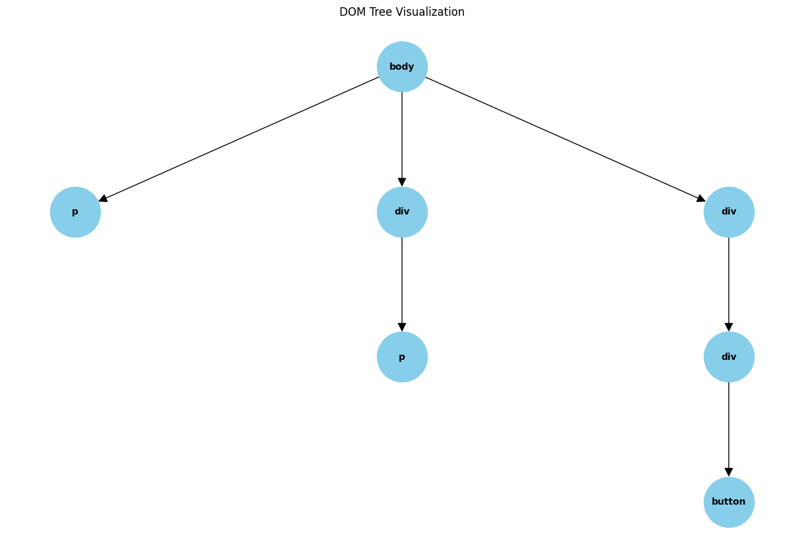

# Action Model Architecture

There are two architectures that I believe are most promising for an action model that is trained to perform digital tasks on few-shot natural language prompts:

1. Large multi-modal foundation model -> Fine-tuning with digital action videos -> RL based reward prediction on digital tasks. (Tree search)
2. RL based action model with TransformerXL/Infini-attention compressive memory.

## Strategy 1: Large Multi-modal Foundation Model

The setup of this strategy is to train a large foundation modal on multi-modal input data, and text output data.

After training the action model, the goal for the action model is to predict the digital action to take given the current state of the web page.

### Pre-training Strcuture

The goal of pretraining of the foundation model is to understand patterns, structure, and context of a world model. You are essentially trying to learn a world model with broad ability that can be fine-tuned to perform digital tasks later.

Data should consist of:

- Text
- Image
- **Video (Most important)**
- _Audio (If available)_

Video data is the most important because it's temporal. If done well, the action in timestep t+1 is dependent on the action in timestep t. This is important for action models because digital tasks and agents have the same time dependency.


_Very simple example from an Adept demo_

#### How to Train On Video Data

The most important aspect of video data is the tokenizer. Current research focuses on using an image tokenizer on the frame level of a video. (this is not ideal and can cause issues with context and sampling)

The most popular image tokenizers are:

- CLIP
- Masked Autoencoder / ViT
- VQGan

A 256x256 image tokenizer returns 16x16 or 256 tokens per image. If you are sampling a video at 30 frames per second, each second of video is 7680 tokens. **This is a lot of tokens in context!**

### Context Strategies

Since you are dealing with video data, your input will have a lot of tokens. Especially if you are using an image tokenizer on the frame level. Even with heavily sampling of 2-3 frames per second, for understanding of a 1 minute action at 3 FPS, you will still need ~46K tokens in context.

How to increase context:

- Sparse Attention
- Recurrent Attention
- Ring Attention / Blockwise Transformers

> **Note:** I think sparse attention is actually a good idea for this action model. (In theory) Different from the text where if you miss a word/phrase, it's hard to recover from context loss, in video since the data is temporal, sliding window attention can actually be a very good idea.

#### Infini-Attention & Ring Attention

- Infini-Attention can be thought of as an LSTM in the form of a transformer. You have compressive memory and your local attention, which is defined by a segment size. The long term memory is compressed from the previous local segments.
- Ring attention is a smart way of parallelizing the attention computation across multiple GPUs where it reduces the effective communication overhead to 0. It's inspired by previous ideas like ring allreduce.

### Supervised Fine-tuning Training Structure

The most important aspect of this phase is data quality. This phase should be done with the following strategy:

Input - `Context of the current structure of webpage (HTML DOM)` + `Video of screen recording of an action` [text + video]

Output - `Detailed instructions of actions to take` [structured text]

_Example of output:_

```text
1. Press on the input tag in the middle of the page.
2. Input the name of the person you want to search for.
3. Press on the search button.
4. Wait for the search results to appear.
5. Click on the first search result.
```

### Agentic RL Alignment

The goal of RL alignment here is long term planning. The agent should be able to predict the next action given the current state of the webpage. If you click on a link and it redirects you elsewhere, it's a lot more steps to achive your desired goal.

I've visualized the graph of the HTML DOM [here](../visualizing-the-dom/README.md).

You can think of any webpage you are trying to automate as a tree of html elements. This is a simple example below:



You have the following:

- **Style elements:** divs and spans
- **Text elements:** p, h1, h2, etc.
- **Link elements:** a, img, etc.
- **Input elements:** input, textarea, etc.
- **Action elements:** buttons.

The style elements can be ignored, the text elements provide the context for the model, input and action elements are important because that is the end state in terms of tree search. Link elements are unique because you can think of them as containing a subtree inside of the main tree. (since you are navigating to another page, another tree)

You want to do tree search on this DOM to find the correct action to take.

## Strategy 2: RL Based Action Model With Compressive Memory

The idea here is to the start with the tree of the HTML DOM and then use RL + Tree search to predict the next action given the current state of the webpage.

This is different from the first strategy because the model doesn't have an inherent world model with understanding of the context of the webpage.

Approaches for context and understanding include the recurrent attention implementations like Infini-Attention and Transformer-XL.

### Data Gathering

1. The training data usually comes in the form of procedurally generated data when the agent interacts with the webpage (environment).
2. The actions an agent can take are the action elements in the HTML DOM.
3. There is an infinite tree that can be generated from all the actions you can take on the internet, but we want those that focused on the task being automated. RL and tree search can help you find the right actions to take.

### Model Architecture

1. Recurrent transformer attention is used to allow the experience to attend over multiple actions.
2. Observations are encoded into a sequence of embeddings.
3. The transformer's outputs are fed into the value and policy of the agent (RL) model.
