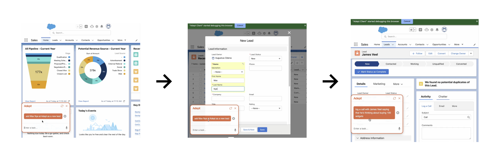

# Data Labeling

> TODO: This section is incomplete, I will be building a data annotator in react this weekend as well.

The strategy to data labeling is to split the video of the workflow you want to automate into multiple segments where each action becomes a segment.

This way you don't need to attend to the entire video, you just need to attention to the action you are trying to automate.

## Data Labeling Web Application

TODO: I'm in the process of building a web application to help segment, and annotate videos.
