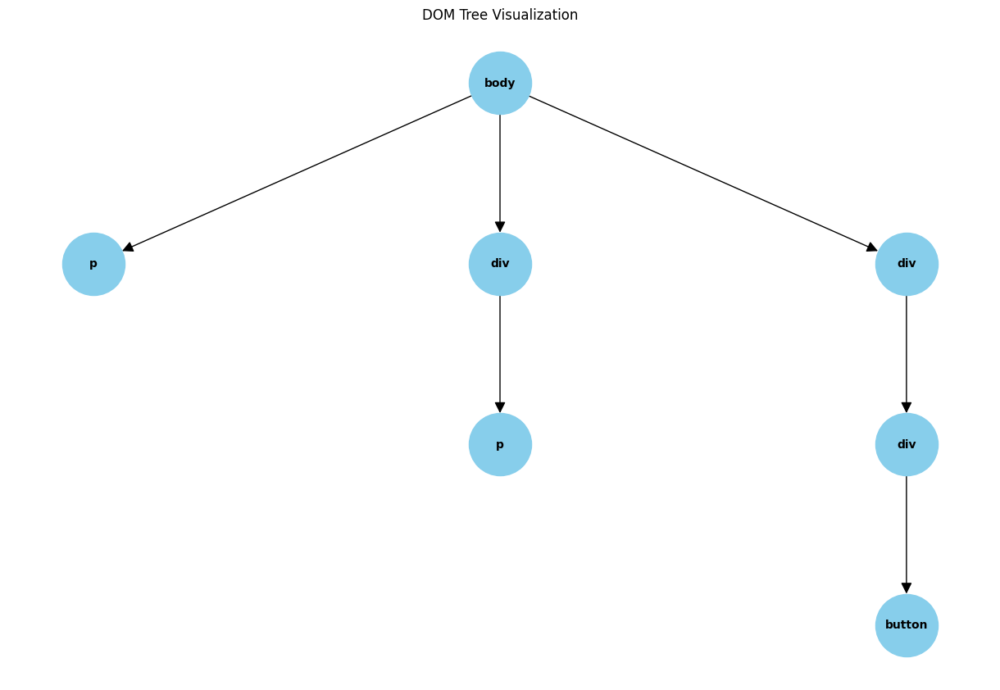

# Visualize the DOM

You can think of any site as a tree of elements. The DOM tree is the tree of all the elements in a web page.

## List of popular HTML elements

This is what the model has to understand on a web page in order to take an action.

**Style Elements**

- `
test
`
- `<a>test</a>`
- `test</img>`
- ` test `
- `
test
`
- `<blockquote>test</blockquote>`
- `<ol>test</ol>`
- `<ul>test</ul>`
- `<li>test</li>`
- `<table>test</table>`
- `<tr>test</tr>`
- `<td>test</td>`
- `<th>test</th>`

**Text Elements**

- `
test
`
- `<h1>test</h1>`
- `<h2>test</h2>`
- `<h3>test</h3>`
- `<h4>test</h4>`
- `<h5>test</h5>`
- `<h6>test</h6>`
- `test`
- `<strong>test</strong>`
- `<em>test</em>`
- `<b>test</b>`
- `<i>test</i>`
- `<u>test</u>`

**Input Elements**

- `<input>test</input>`
- `<textarea>test</textarea>`
- `<select>test</select>`
- `<option>test</option>`

**Button + Link Elements**

- `<button>test</button>`
- `<a>test</a>`
- `<link>test</link>`
- `<link>test</link>`

**Form Elements**

- `<form>test</form>`
- `<label>test</label>`
- `<input>test</input>`
- `<textarea>test</textarea>`
- `<select>test</select>`
- `<option>test</option>`
- `<button>test</button>`

## Tree Search

You can think of the DOM as a tree of the HTML elements. An example of a DOM tree is shown below:

After a foundation model is trained, you want to do tree search on this DOM to find the correct action to take.

## Action Elements

The HTML elements that serve a specific action are elements like `<button>`, `<a>`, `<input>`, etc.

These are what can change the state of the web page.

If you are training an RL model, these are the elements which you take actions on, explore the state space, produce a policy with, and predict the value estimate.

## Redirect Elements

These are elements that change the URL of the web page. Which in a sense changes the TREE of the page. You can think of these elements as having a nested tree structure within the main tree.

This can heavily grow the size of the state space which require more exploration or more spophistcated serach algorithms.
